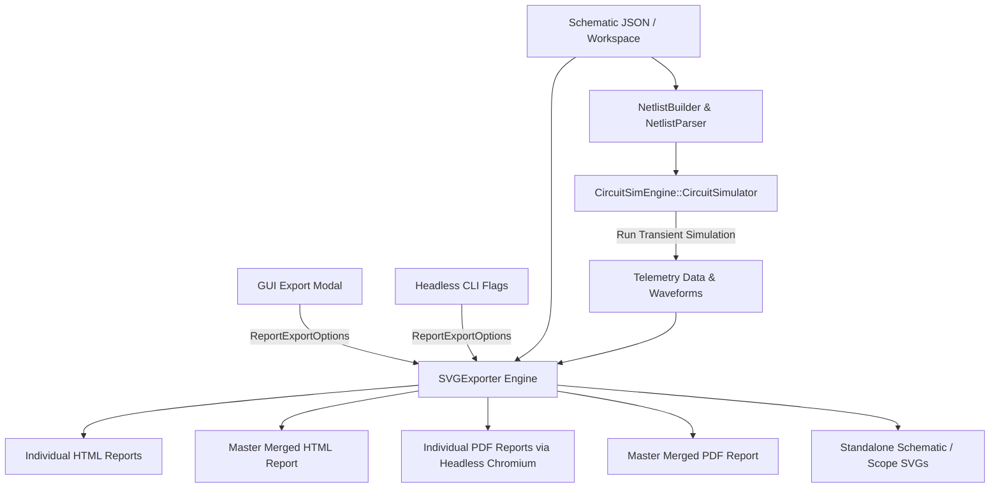

# SimPEL / CircuitSim Pro: CLI & Export Features Technical Guide

This document provides a comprehensive technical overview and reference manual for the **Command Line Interface (CLI)** and **Multi-Format Export Engine (HTML / PDF / SVG)** implemented in SimPEL / CircuitSim Pro C++ Edition.

---

## Table of Contents

1. [Architecture Overview](#1-architecture-overview)
2. [Interactive GUI Export Configuration](#2-interactive-gui-export-configuration)
   - [Modal Dialog Trigger Points](#modal-dialog-trigger-points)
   - [Configuration Parameters & Options](#configuration-parameters--options)
3. [Headless CLI Automation Engine](#3-headless-cli-automation-engine)
   - [Command-Line Flag Reference](#command-line-flag-reference)
   - [Practical CLI Examples](#practical-cli-examples)
4. [C++ Codebase & Function Reference](#4-c-codebase--function-reference)
   - [Data Structures & Enumerations](#data-structures--enumerations)
   - [SVGExporter Class Methods](#svgexporter-class-methods)
   - [MainWindow Integration Methods](#mainwindow-integration-methods)
   - [CLI Core Processing Pipeline](#cli-core-processing-pipeline)
5. [Report Layout & Rendering Pipeline](#5-report-layout--rendering-pipeline)
   - [Schematic SVG Bounding Box & Alignment](#schematic-svg-bounding-box--alignment)
   - [Oscilloscope Waveform Generation](#oscilloscope-waveform-generation)
   - [Collapsible JSON Structures](#collapsible-json-structures)
   - [Master Merged Report & Table of Contents](#master-merged-report--table-of-contents)
   - [Headless Print-to-PDF Engine](#headless-print-to-pdf-engine)

---

## 1. Architecture Overview

The SimPEL / CircuitSim Pro reporting subsystem provides dual-mode verification and export:
1. **Interactive Desktop UI (ImGui)**: A user-friendly modal dialog providing visual toggles for formatting, batch scopes, waveform rendering, and JSON presentation.
2. **Headless CLI Engine**: A non-interactive console mode enabling automated batch simulation, parameter sweeps, CI/CD verification pipelines, and unattended report generation.

Both modes share the identical core simulation backend (`CircuitSimulator`), netlist parser (`NetlistParser`), and high-fidelity vector rendering engine (`SVGExporter`).



---

## 2. Interactive GUI Export Configuration

### Modal Dialog Trigger Points

The **Report Export Configuration** popup modal (`renderExportOptionsModal`) can be accessed from three places in the application:

1. **Top Menu Bar $\rightarrow$ File $\rightarrow$ Export Report (HTML / PDF)...**:
   Opens the configuration dialog for the currently active schematic on the canvas.
2. **Top Menu Bar $\rightarrow$ File $\rightarrow$ Batch Export Reports for Folder (HTML / PDF)...**:
   Prompts for a target directory containing `.json` schematic files, then opens the configuration dialog in batch mode.
3. **Batch Simulate Folder Completion Prompt**:
   After choosing **File $\rightarrow$ Batch Simulate Folder (.json)...** and simulating all circuits, a notification asks: *"Would you like to configure and export reports now?"*. Clicking **Yes** immediately opens the export dialog pre-populated with that folder.

---

### Configuration Parameters & Options

The configuration modal provides intuitive controls categorized into four sections:

| Category | UI Control | Parameter / Setting | Description |
| :--- | :--- | :--- | :--- |
| **Target Directory** | Text Input + Browse Button | `exportTargetFolder` | Active in batch mode; specifies the target directory containing `.json` files. |
| **Export Format** | Dropdown Combo | `ReportExportFormat` | Select from: <br>• `HTML Document (.html)`<br>• `PDF Document (.pdf)`<br>• `Both (HTML + PDF Documents)` |
| **Batch Scope** | Checkbox | `exportIndividual` | Generates separate `<filename>_report.html` (and/or `.pdf`) for each circuit in the folder. |
| | Checkbox | `exportMerged` | Generates a single unified `_all_simulation_reports_merged.html` (and/or `.pdf`) with an interactive Table of Contents. |
| **Content Inclusion** | Checkbox | `includeSchematicSvg` | Embeds the full vector schematic SVG diagram at the top of each report. |
| | Checkbox | `includeWaveforms` | Simulates and renders vector SVG oscilloscope waveform traces for all connected scope and probe channels. |
| | Checkbox | `includeSchematicJson` | Embeds the raw schematic CAD JSON structure into the report. |
| | Checkbox | `includeNetlistJson` | Embeds the resolved simulation netlist JSON specification into the report. |
| **JSON Section Layout** | Checkbox | `jsonCollapsible` | Encloses JSON blocks in HTML `<details>` disclosure tags with toggle arrows. |
| | Checkbox (Indented) | `jsonDefaultExpanded` | When collapsible is enabled, sets whether the `<details>` elements start expanded (`open`) or collapsed by default. |

---

## 3. Headless CLI Automation Engine

SimPEL / CircuitSim Pro features a built-in headless execution mode. When launched with CLI flags, it runs without initializing an OpenGL window or ImGui context, executing tasks at maximum CPU throughput.

### Command-Line Flag Reference

```
Usage: circuitsim_pro_win.exe -i <input.json> [options]
   or: circuitsim_pro_win.exe -dir <folder> [options]
```

| Flag | Short Form | Arguments | Description |
| :--- | :--- | :--- | :--- |
| `--input` | `-i` | `<file.json>` | Path to a single input schematic JSON file. |
| `--input-dir`, `--dir` | `-dir` | `<directory>` | Path to a folder of `.json` files for batch simulation & export. |
| `--output`, `--html` | `-o` | `<output.html>` | Custom destination path for the generated report (Default: `<input>_report.html`). |
| `--pdf` | — | — | Export as high-fidelity PDF (via headless browser vector engine). |
| `--both` | — | — | Export both HTML and PDF formats concurrently. |
| `--export-svg` | `-s` | `<output.svg>` | Export a standalone vector SVG schematic diagram file. |
| `--param` | `-p` | `CompId.Param=Val` | Override any component parameter before simulation (e.g. `-p L1.L=150u -p R1.R=10`). |
| `--tstop` | `-t` | `<seconds>` | Override simulation transient stop time (e.g. `-t 0.05`). |
| `--step` | `-dt` | `<seconds>` | Override maximum simulation integration time step (e.g. `-dt 1e-6`). |
| `--no-json` | — | — | Exclude schematic and netlist JSON blocks from the report. |
| `--expanded-json` | — | — | Ensure collapsible JSON blocks start in expanded state. |
| `--static-json` | — | — | Render JSON blocks as plain static cards rather than collapsible `<details>`. |
| `--merged-only` | — | — | Batch mode: only generate the unified master report `_all_simulation_reports_merged`. |
| `--individual-only` | — | — | Batch mode: only generate individual reports, skipping the merged master report. |
| `--help` | `-h` | — | Display the CLI flag documentation and exit. |

---

### Practical CLI Examples

#### 1. Single Circuit Simulation & PDF + HTML Export
```powershell
.\build\circuitsim_pro_win.exe -i "working jsons/Buck_converter.json" --both
```
*Outputs `Buck_converter_report.html` and `Buck_converter_report.pdf` in the same directory.*

#### 2. Parameter Sweep Simulation
```powershell
.\build\circuitsim_pro_win.exe -i "working jsons/Buck_converter.json" -p L1.L=300u -p Rload.R=15 -t 0.04 -o "reports/Buck_HighInductance_report.html" --pdf
```
*Overrides inductance to $300\mu\text{H}$, load resistance to $15\Omega$, simulates for $40\text{ms}$, and exports to PDF.*

#### 3. Batch Folder Verification (Entire Test Suite)
```powershell
.\build\circuitsim_pro_win.exe -dir "working jsons/test unit for each block" --both
```
*Simulates all 80+ unit tests, generating individual HTML + PDF reports alongside a unified master report `_all_simulation_reports_merged.html` & `.pdf`.*

#### 4. Clean Master Documentation Report (No JSON, Merged Only)
```powershell
.\build\circuitsim_pro_win.exe -dir "working jsons" --no-json --merged-only --pdf
```
*Simulates all schematics and compiles a sleek, executive vector PDF report containing only circuit schematics and oscilloscope waveforms.*

---

## 4. C++ Codebase & Function Reference

The export and CLI infrastructure is implemented across the following source files:
- `src/ui/SVGExporter.hpp` & `src/ui/SVGExporter.cpp`
- `src/ui/MainWindow.hpp` & `src/ui/MainWindow.cpp`
- `src/main.cpp`

---

### Data Structures & Enumerations

```cpp
namespace CircuitSim {

enum class ReportExportFormat {
    HTML = 0,          // Standard Light Mode HTML5 document
    PDF = 1,           // Vector PDF document generated via headless browser
    BOTH_HTML_PDF = 2  // Both HTML5 and PDF documents
};

struct ReportExportOptions {
    ReportExportFormat format = ReportExportFormat::HTML;
    bool exportIndividual = true;      // Export individual circuit reports
    bool exportMerged = true;          // Export master merged report
    bool includeSchematicSvg = true;   // Include schematic diagram SVG
    bool includeWaveforms = true;      // Include oscilloscope waveforms
    bool includeSchematicJson = true;  // Include Schematic JSON structure
    bool includeNetlistJson = true;    // Include Netlist JSON specification
    bool jsonCollapsible = true;       // Make JSON sections collapsible (<details>)
    bool jsonDefaultExpanded = false;  // Collapsible JSON starts expanded (<details open>)
};

struct ScopeReportData {
    std::string scopeId;
    std::string scopeTitle;
    std::vector<std::string> signalKeys;
    std::vector<std::string> signalLabels;
    int numPanes = 1;
};

struct CircuitReportItem {
    std::string jsonName;
    CircuitDesign design;
    CircuitSimEngine::TelemetryData telemetry;
    std::vector<ScopeReportData> scopesData;
    std::string schematicJson;
    std::string netlistJson;
};

} // namespace CircuitSim
```

---

### SVGExporter Class Methods

#### `exportFullReportToHTML`
```cpp
static bool exportFullReportToHTML(
    const CircuitDesign& design,
    const CircuitSimEngine::TelemetryData& telemetry,
    const std::vector<ScopeReportData>& scopesData,
    const std::string& schematicJson,
    const std::string& netlistJson,
    const std::string& filename,
    bool isDarkMode = false,
    const ReportExportOptions& options = ReportExportOptions()
);
```
- **Description**: Generates a self-contained HTML report combining schematic vector graphics, multi-pane oscilloscope waveform SVGs, schematic JSON, and netlist JSON.
- **Behavior**:
  - Automatically extracts the circuit file name to display in the header badge (`Schematic: <name>.json`).
  - Conditionally renders sections according to `options`.
  - Injects print stylesheet (`@media print`) and copy-to-clipboard scripts.
  - If `options.format` is `PDF` or `BOTH_HTML_PDF`, invokes `convertHtmlToPdf`.

#### `exportMergedReportToHTML`
```cpp
static bool exportMergedReportToHTML(
    const std::vector<CircuitReportItem>& reports,
    const std::string& filename,
    const ReportExportOptions& options = ReportExportOptions()
);
```
- **Description**: Compiles multiple circuit simulation results into a single master document.
- **Behavior**:
  - Generates an interactive Table of Contents linking to each numbered circuit (`#report_1`, `#report_2`, etc.).
  - Renders each circuit report with smooth scrolling and "↑ Back to Top" navigation links.
  - Includes `@media print` rules that enforce clean page breaks before each circuit section.
  - Generates a merged PDF if requested in `options`.

#### `convertHtmlToPdf`
```cpp
static bool convertHtmlToPdf(const std::string& htmlPath, const std::string& pdfPath);
```
- **Description**: Converts an existing HTML report into a vector PDF using headless Microsoft Edge or Google Chrome installed on the host system.
- **Mechanism**:
  - Locates the browser binary from standard system installation directories.
  - Executes: `"<browser>" --headless --disable-gpu --no-pdf-header-footer --print-to-pdf="<pdf>" "<htmlUrl>"`.
  - Spawns the process using Win32 `CreateProcessA` with `CREATE_NO_WINDOW` and `SW_HIDE` to operate silently.

#### `exportSchematicToSVGString` / `exportSchematicToSVG`
```cpp
static bool exportSchematicToSVGString(const CircuitDesign& design, std::string& outSVG, bool isDarkMode = true);
static bool exportSchematicToSVG(const CircuitDesign& design, const std::string& filename, bool isDarkMode = true);
```
- **Description**: Computes exact component pin-inclusive bounding boxes and renders all components, symbols, terminals, labels, and wires into clean vector SVG format.

#### `exportScopeToSVGString` / `exportScopeToSVG`
```cpp
static bool exportScopeToSVGString(
    const CircuitSimEngine::TelemetryData& telemetry,
    const std::vector<std::string>& signalKeys,
    const std::vector<std::string>& labels,
    const std::string& scopeTitle,
    std::string& outSVG,
    int numPanes = 1,
    bool isDarkMode = true,
    double timeMin = -1.0, double timeMax = -1.0
);
```
- **Description**: Generates multi-pane vector oscilloscope SVGs with grid lines, axis tick labels, color-coded trace lines, and interactive legends.

---

### MainWindow Integration Methods

| Method | Purpose |
| :--- | :--- |
| `void renderExportOptionsModal()` | Renders the ImGui modal dialog allowing interactive selection of format, scope, content inclusion, and JSON layout. |
| `void executeSingleExportWithOptions(const ReportExportOptions& options)` | Runs simulation for the current canvas circuit, traces all scope channels, and generates the report. |
| `void executeBatchExportWithOptions(const std::string& folderPath, const ReportExportOptions& options)` | Iterates over all `.json` files in `folderPath`, runs transient simulations, writes individual reports (if enabled), and compiles the merged master report (if enabled). |
| `void batchSimulateFolder(const std::string& folderPath)` | Performs batch simulation and prompts the user to open the report export configuration dialog. |
| `void batchExportHtmlFolder(const std::string& folderPath)` | Opens the export modal directly in batch mode for the selected directory. |

---

### CLI Core Processing Pipeline

In `src/main.cpp`:

- `runHeadlessCLI(int argc, char** argv)`:
  - Parses command line arguments using standard POSIX/GNU conventions.
  - Attaches to parent console (`AttachConsole(ATTACH_PARENT_PROCESS)`).
  - Routes execution to `processSingleJsonFile` or directory batch processing loop.
- `processSingleJsonFile(...)`:
  - Loads schematic JSON from disk.
  - Applies parameter overrides specified via `-p` / `--param`.
  - Builds netlist nodes and parses component models (`NetlistParser`).
  - Executes numerical transient solver (`simulator.runTransient()`).
  - Gathers scope telemetry and invokes `SVGExporter::exportFullReportToHTML`.

---

## 5. Report Layout & Rendering Pipeline

### Schematic SVG Bounding Box & Alignment
Previous versions used fixed Canvas bounding boxes, resulting in excess white space around smaller circuits. The current engine computes tight bounding boxes by examining:
$$\text{minX} = \min_{c \in \text{components}, p \in c.\text{pins}}(c.x + p.\text{relX}) - 20$$
$$\text{maxX} = \max_{c \in \text{components}, p \in c.\text{pins}}(c.x + p.\text{relX}) + 20$$
The SVG element is configured with a proportional `viewBox` and responsive CSS (`max-width: 100%; height: auto;`), ensuring optimal scaling on screens and print documents without vertical truncation.

### Oscilloscope Waveform Generation
- Plots each channel into distinct subplots or overlaid panes depending on configuration.
- Automatically selects contrasting trace colors (blue `#0284c7`, amber `#d97706`, green `#16a34a`, purple `#9333ea`, red `#dc2626`).
- Emits clean SVG `<polyline>` elements with vector anti-aliasing.

### Collapsible JSON Structures
- Schematic CAD JSON and simulation netlists are enclosed in `<details>` disclosure tags.
- Includes a dedicated `Copy JSON` / `Copy Netlist` button using browser `navigator.clipboard.writeText` APIs.

### Master Merged Report & Table of Contents
- Emits a responsive grid Table of Contents listing all schematics with direct anchor links (`#report_1`, `#report_2`, ...).
- Each circuit card features a quick "↑ Back to Top" anchor link.

### Headless Print-to-PDF Engine
Injected print styling guarantees professional PDF output:
```css
@media print {
  body { padding: 0; background: #fff; }
  .toc-card, .back-top, .copy-btn { display: none !important; }
  .circuit-section { page-break-before: always; break-before: page; margin-bottom: 24px; }
  .card { box-shadow: none; border: 1px solid #cbd5e1; break-inside: avoid; page-break-inside: avoid; }
  details { display: block !important; }
  pre { max-height: none !important; overflow: visible !important; }
}
```
- Eliminates UI buttons from printed PDFs.
- Forces `<details>` sections open so code listings are visible on paper.
- Prevents page breaks in the middle of schematic diagrams or scope waveform cards (`page-break-inside: avoid`).

---

*Document generated for SimPEL / CircuitSim Pro C++ Edition.*
